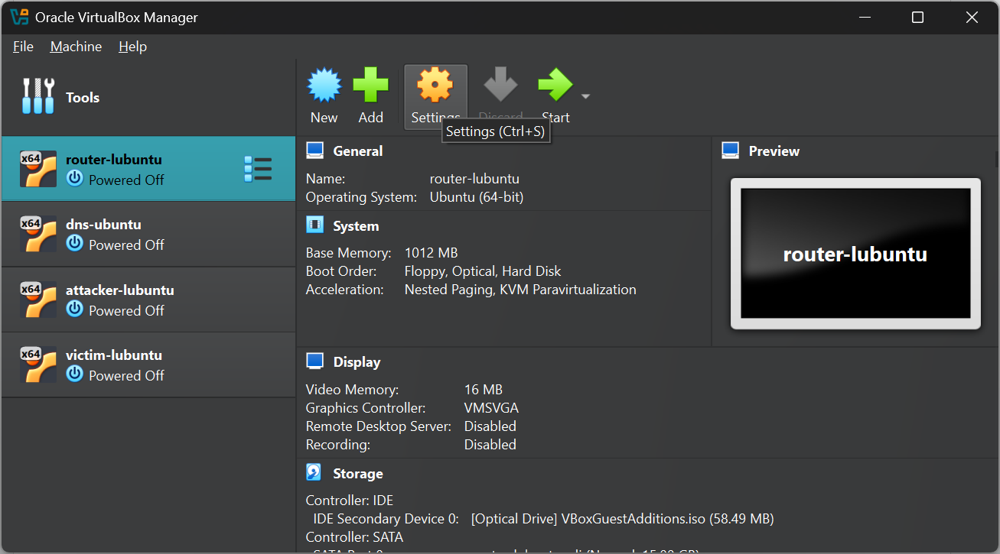
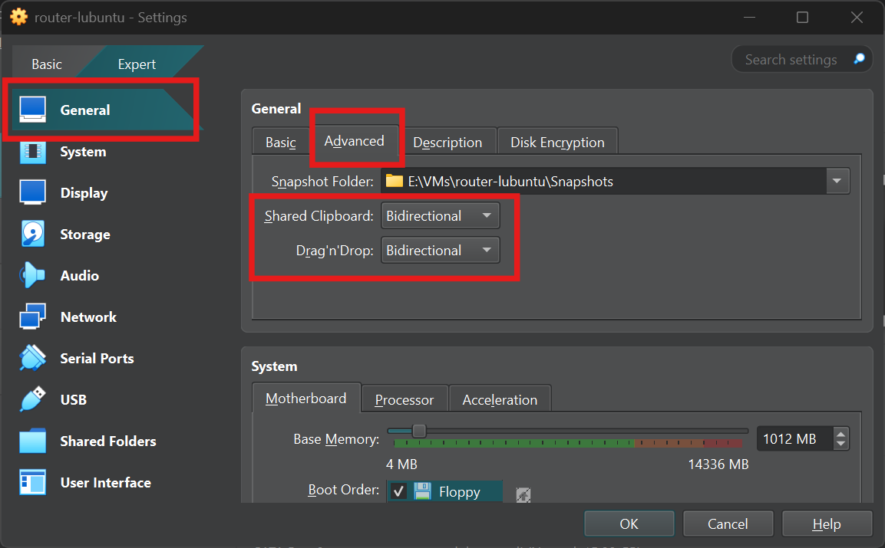
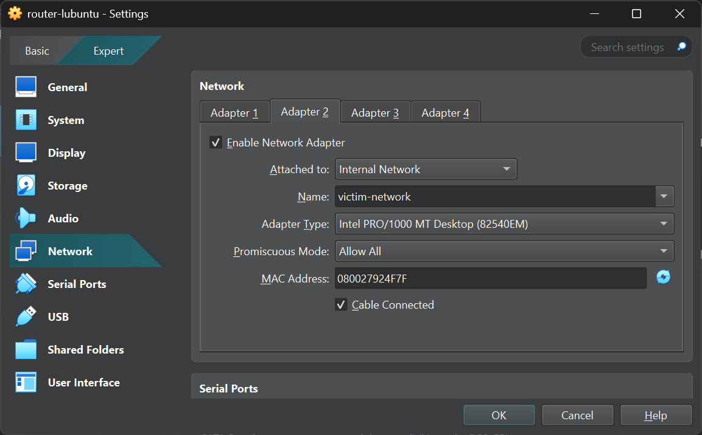
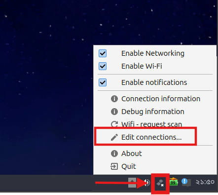
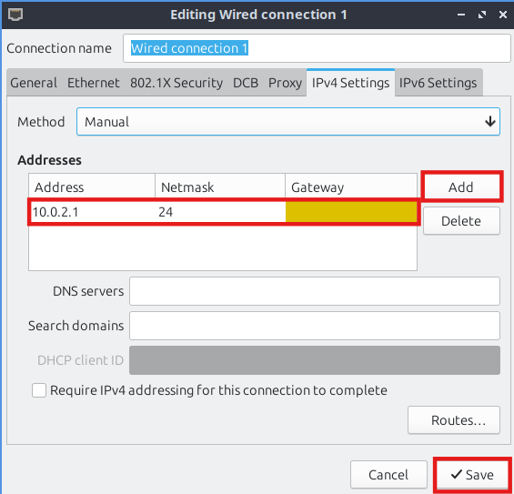
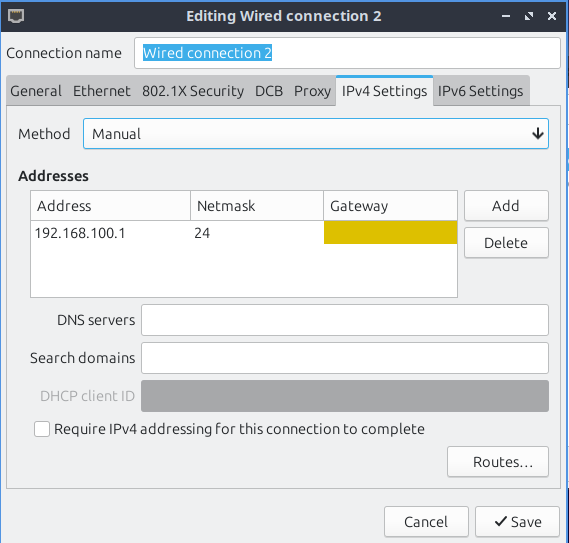
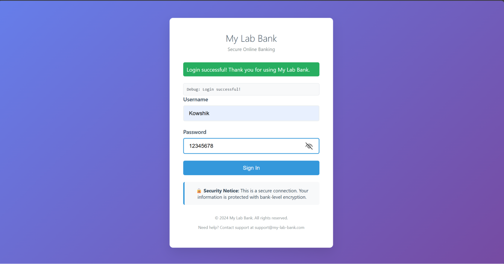
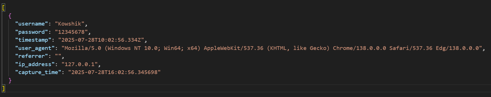

# 🚨 DNS Cache Poisoning and Phishing Attack

> **⚠️ Disclaimer**: This project is for educational purposes only. It demonstrates DNS cache poisoning vulnerabilities and should only be used in controlled environments for learning cybersecurity concepts.

## Environment Setup

The virtual machine (VM) application used is **VirtualBox**. The VM OS is **Lubuntu 24.04.2 LTS**.

### VM Configuration

| VM Role | RAM | vCPU | Storage |
|---------|-----|------|---------|
| **Router VM** | 1 GB | 1 | 15 GB |
| **DNS Resolver VM** | 1 GB | 1 | 15 GB |
| **Attacker VM** | 2 GB | 2 | 15 GB |
| **Victim VM** | 2 GB | 2 | 15 GB |

A minimal installation is recommended. A browser can be installed separately on the Victim machine and the Attacker machine for testing.

Keep the "Pre-allocate Full Size" option disabled.


*VirtualBox VM setup and configuration interface*

### Clipboard Sharing and Drag & Drop


*Accessing VirtualBox VM settings*


*Configuring clipboard sharing and drag & drop features*

After starting the VM, insert the Guest Additions CD image from the menu.


*Inserting Guest Additions CD image from VirtualBox menu*


*VBox Guest Additions icon on the Taskbar*


*Open Guest Additions CD image from Taskbar menu*

Right-click on empty space inside VBox_GAs window and choose "Open in Terminal".

In the terminal, run `sudo ./VBoxLinuxAdditions.run`. Restart the VM after completion using `sudo reboot`. These steps need to be performed on each VM.

## Package Installation

Install all the required packages before setting up the internal network, as there won't be an internet connection afterwards. `gedit` is a text editor that provides a better experience than the built-in `nano` editor and can be skipped if not desired. Any text-related file can be opened with the command `gedit filename` from the terminal.

### Router
```bash
sudo apt update
sudo apt install -y python3 python3-pip net-tools tcpdump curl gedit
```

### DNS Resolver
```bash
sudo apt update
sudo apt install -y python3 python3-pip python3-scapy net-tools tcpdump curl gedit
```

### Attacker
```bash
sudo apt update
sudo apt install -y python3 python3-pip python3-scapy python3-flask python3-flask-cors net-tools tcpdump curl gedit
```

[Install Firefox](https://support.mozilla.org/en-US/kb/install-firefox-linux#w_install-firefox-deb-package-for-debian-based-distributions-recommended) on the Attacker VM.

### Victim
```bash
sudo apt update
sudo apt install -y python3 python3-pip net-tools tcpdump curl gedit
```

[Install Firefox](https://support.mozilla.org/en-US/kb/install-firefox-linux#w_install-firefox-deb-package-for-debian-based-distributions-recommended) on the Victim VM.

## Network Configuration

Configure the network adapters for each VM.

### Router
- **Adapter 1 (enp0s3)**
  - Attached to: Internal Network
  - Name: `attacker-network`
  - Promiscuous Mode: Allow All
- **Adapter 2 (enp0s8)**
  - Attached to: Internal Network
  - Name: `victim-network`
  - Promiscuous Mode: Allow All

### DNS Resolver
- **Adapter 1 (enp0s3)**
  - Attached to: Internal Network
  - Name: `victim-network`
  - Promiscuous Mode: Deny

### Attacker
- **Adapter 1 (enp0s3)**
  - Attached to: Internal Network
  - Name: `attacker-network`
  - Promiscuous Mode: Deny

### Victim
- **Adapter 1 (enp0s3)**
  - Attached to: Internal Network
  - Name: `victim-network`
  - Promiscuous Mode: Deny

## IP Configuration

Configure the IP settings for each VM.

### Router
- **Wired Connection 1 (enp0s3)**
  - Address: 10.0.2.1
  - Netmask: 24
- **Wired Connection 2 (enp0s8)**
  - Address: 192.168.100.1
  - Netmask: 24
- In the terminal, run:
  ```bash
  sudo sysctl -w net.ipv4.ip_forward=1
  ```

### DNS Resolver
- **Wired Connection 1 (enp0s3)**
  - Address: 192.168.100.10
  - Netmask: 24
  - Gateway: 192.168.100.1

### Attacker
- **Wired Connection 1 (enp0s3)**
  - Address: 10.0.2.15
  - Netmask: 24
  - Gateway: 10.0.2.1

### Victim
- **Wired Connection 1 (enp0s3)**
  - Address: 192.168.100.30
  - Netmask: 24
  - Gateway: 192.168.100.1

### Network and IP Config Setup Demo (Router)


*VM network configuration for Adapter 1*


*VM network configuration for Adapter 2*

Hit OK and start the VM. 

Right-click on the Network icon and go to "Edit Connections" to configure the IP addresses.



*Accessing Network Manager*


*Network Manager showing available connections*


*Setting up IP addresses and network parameters for Wired Connection 1*


*Setting up IP addresses and network parameters for Wired Connection 2*


Hit Save.

To verify the IP configuration, run `ip addr show` in the terminal. The output should include entries for `enp0s3` and `enp0s8` with their new IP addresses. This command may need to be run twice for refreshing.

## Extra Configuration Steps

### Router
- Route 8.8.8.8 traffic through `enp0s8`:
  ```bash
  sudo ip route add 8.8.8.8/32 dev enp0s8
  ```
  The router must send spoofed responses from the Attacker to the DNS resolver.

### DNS Resolver
- Disable `systemd-resolved`:
  ```bash
  sudo systemctl stop systemd-resolved
  sudo systemctl disable systemd-resolved
  ```
- Verify the status of `systemd-resolved`:
  ```bash
  sudo systemctl status systemd-resolved
  ```
- Update DNS Configuration:
  ```bash
  sudo nano /etc/resolv.conf
  ```
  Add this line: `nameserver 8.8.8.8`. Then press `Ctrl + X` and `Y` to save the file.
- Verify the DNS configuration:
  ```bash
  cat /etc/resolv.conf
  ```
- ICMP Config (Block ICMP Errors):
  ```bash
  echo "net.ipv4.icmp_echo_ignore_all=0" | sudo tee -a /etc/sysctl.conf
  echo "net.ipv4.icmp_echo_ignore_broadcasts=0" | sudo tee -a /etc/sysctl.conf
  echo "net.ipv4.icmp_ignore_bogus_error_responses=1" | sudo tee -a /etc/sysctl.conf
  echo "net.ipv4.conf.all.accept_redirects=0" | sudo tee -a /etc/sysctl.conf
  echo "net.ipv4.conf.all.send_redirects=0" | sudo tee -a /etc/sysctl.conf
  ```
- Verify the ICMP configuration:
  ```bash
  grep icmp /etc/sysctl.conf
  grep redirect /etc/sysctl.conf
  ```
- In all the VMs, disable the firewall.
  - Check status with `sudo ufw status`.
  - Disable if enabled with `sudo ufw disable`.
- Ping all other devices from each device to check if the connection has been established properly.

## Disabling Security Features of the Browser (Firefox)

In the address bar of Firefox, type `about:config`. Search for the following settings and set them to the specified values:

- `browser.safeBrowse.downloads.enabled` → `false`
- `browser.safeBrowse.downloads.remote.block_potentially_unwanted` → `false`
- `browser.safeBrowse.malware.enabled` → `false`
- `browser.safeBrowse.phishing.enabled` → `false`
- `network.trr.mode` → `5`
- `security.OCSP.require` → `false`
- `dom.disable_open_during_load` → `false`

## The Attack

### DNS Resolver VM
```bash
sudo python3 dns_resolver.py
```

### Attacker VM

**Options**:
- `--target`: Target DNS server IP. (default="192.168.100.10")
- `--domain`: Target domain for poisoning. (default="friendsbook.com")
- `--requests`: Number of DNS requests to send. (default=1000)
- `--responses`: Number of spoofed responses per request. (default=1000)
- `--tries`: Number of attack rounds. (default=10)
- `--delay`: Delay between requests (ms). (default=0)
- `--verify`: Verify poisoning after attack. (action="store_true")
- `--test-domain`: Domain to test for poisoning verification.
- `--verbose`: Enable verbose output. (action="store_true")

**Run**:
```bash
sudo python3 attack.py --requests 1 --responses 65536 --tries 5
```

## Phishing

### Attacker VM
```bash
python3 ./phishing_site/server.py
```

### Victim VM
- Open the browser.
- Search for `friendsbook.com`.

The Victim will be routed to the website that the Attacker is hosting.


*The phishing site mimicking a legitimate social media login page*

The entered username and password can be found in the file `/phishing_site/captured_credentials.json` on the Attacker VM.


*Example of captured credentials stored in JSON format*

---

## 🛡️ Defense and Mitigation

This demonstration highlights the importance of:
- **DNSSEC implementation** for DNS integrity
- **User awareness** about phishing attacks
- **HTTPS verification** and certificate validation
- **Two-factor authentication** for critical accounts

## 📚 Educational Purpose

This project is designed for cybersecurity education and should only be used in controlled laboratory environments with proper authorization.