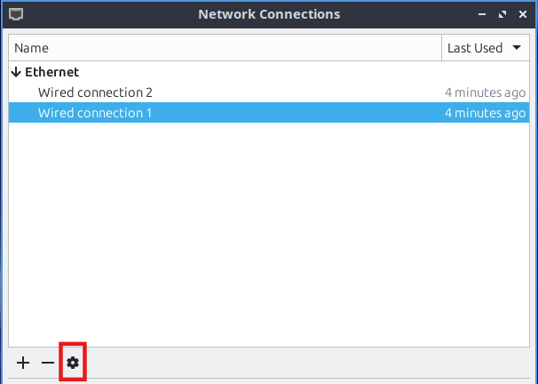
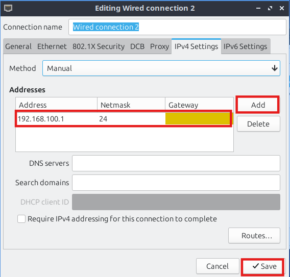

# 🚨 DNS Cache Poisoning and Phishing Attack

> **⚠️ Disclaimer**: This project is for educational purposes only. It demonstrates DNS cache poisoning vulnerabilities and should only be used in controlled environments for learning cybersecurity concepts.

## Introduction

This project demonstrates a complete **DNS Cache Poisoning and Phishing Attack** using the **Kaminsky technique**, one of the most effective methods for exploiting DNS vulnerabilities. The demonstration showcases how attackers can manipulate DNS resolution to redirect victims to malicious websites and harvest their credentials.

### What is DNS Cache Poisoning?

DNS Cache Poisoning (also known as DNS Spoofing) is a cyberattack that exploits vulnerabilities in the Domain Name System (DNS) to redirect domain name queries to malicious IP addresses. When successful, victims attempting to visit legitimate websites are unknowingly redirected to attacker-controlled servers.

### The Kaminsky Attack

Named after security researcher Dan Kaminsky, this attack method exploits the DNS protocol's reliance on 16-bit transaction IDs for response validation. The attack works by:

1. **Triggering Cache Misses**: Sending queries for non-existent subdomains to force DNS lookups
2. **Response Flooding**: Overwhelming the DNS resolver with spoofed responses containing different transaction IDs
3. **Transaction ID Guessing**: Attempting to match the resolver's outbound query transaction ID
4. **Authority Section Poisoning**: Including malicious nameserver information to gain control over entire domains

### Attack Scenario

In this demonstration:
- **Target Domain**: `friendsbook.com` (simulating a social media platform)
- **Attack Vector**: DNS cache poisoning followed by credential harvesting
- **Network Setup**: Isolated virtual machine environment with realistic network topology
- **Outcome**: Victim credentials captured through a convincing phishing interface

### Learning Objectives

By completing this demonstration, you will understand:
- How DNS resolution works and where vulnerabilities exist
- The technical mechanics of the Kaminsky DNS cache poisoning attack
- How poisoned DNS entries can be leveraged for phishing attacks
- The importance of DNS security measures like DNSSEC
- Practical mitigation strategies for both system administrators and end users

### Prerequisites

- Basic understanding of networking concepts (IP addresses, routing, DNS)
- Familiarity with Linux command line operations
- Knowledge of virtualization platforms (VirtualBox)
- Understanding of cybersecurity principles and ethical considerations

---

## The Kaminsky Attack - Technical Overview

### Attack Mechanism

The implemented attack is based on the **Kaminsky DNS Cache Poisoning technique**, which exploits the DNS protocol's reliance on transaction IDs for response validation. Here's how the attack works:

#### Network Topology
- **Attacker VM** (10.0.2.15): Located in an external network, connected to the resolver and victim through the router
- **DNS Resolver VM** (192.168.100.10): Acts as a caching DNS server for the victim network
- **Victim VM** (192.168.100.30): The target user who will be redirected to the phishing site
- **Router VM**: Bridges the attacker and victim networks, forwards spoofed packets

#### Attack Flow

1. **Initial Query**: The attacker sends a DNS query for a random subdomain of the target domain (e.g., `abc123def.friendsbook.com`) to the DNS resolver.

2. **Cache Miss**: The DNS resolver checks its cache for the queried domain. Since the query contains a non-existent random subdomain, a cache miss occurs.

3. **Query Forwarding**: The resolver forwards the query to the upstream DNS server (8.8.8.8) with a specific transaction ID.

4. **Response Flooding**: Simultaneously, the attacker floods the resolver with thousands of spoofed DNS responses, impersonating 8.8.8.8. Each response contains a different transaction ID, attempting to guess the correct one.

5. **Transaction ID Matching**: The DNS resolver accepts a response only when the transaction/query ID matches the one it used when forwarding the query to the actual DNS server.

6. **Cache Poisoning**: When a spoofed response with the correct transaction ID is accepted, the resolver caches the malicious entry. The spoofed response includes:
   - **Answer Section**: Maps the random subdomain to the attacker's IP
   - **Authority Section**: Claims the attacker's server is the authoritative nameserver for `friendsbook.com`
   - **Additional Section**: Provides the attacker's IP as the nameserver's address

7. **Domain Hijacking**: After successful poisoning, the DNS resolver caches entries that redirect `friendsbook.com` and all its subdomains to the attacker's IP (10.0.2.15).

8. **Victim Redirection**: When the victim queries `friendsbook.com`, the poisoned resolver returns the attacker's IP instead of the legitimate one.

9. **Credential Harvesting**: The victim is routed to the malicious phishing site hosted by the attacker, where entered credentials are captured and stored in a JSON file.

#### Implementation Features

- **Continuous Verification**: The attack includes a separate verification thread that continuously monitors whether the cache poisoning was successful
- **Random Subdomain Generation**: Creates unique random subdomains to ensure cache misses and avoid detection
- **Realistic Attack Flow**: The attacker discovers success through verification queries rather than knowing when the correct transaction ID was guessed
- **Multi-threaded Architecture**: Parallel attack threads maximize the chances of successful poisoning

#### Security Features Disabled

Modern DNS servers implement multiple security mechanisms that make Kaminsky attacks extremely difficult or impossible. To demonstrate this attack in a controlled educational environment, the following security features were intentionally disabled in our custom DNS resolver:

- **Port Randomization**: Modern DNS resolvers use random source ports (not just random transaction IDs) to make response spoofing significantly harder. Our custom resolver uses a fixed port (5000) for outbound queries, making it vulnerable to response flooding attacks.

- **ICMP Error Handling**: Production DNS servers properly handle ICMP error messages and can detect network anomalies that might indicate spoofing attempts. The ICMP error handling was disabled in the resolver configuration to prevent interference with spoofed responses.

- **DNS Timeout and Retry Logic**: Commercial DNS servers implement sophisticated timeout mechanisms and query retry logic that can help detect and mitigate response flooding attacks. Our implementation uses extended timeouts and simplified retry logic to allow sufficient time for the attack to succeed.

> **Note**: Modern DNS servers like BIND, Unbound, and commercial solutions are highly secure and include comprehensive protection against cache poisoning attacks. This demonstration required a custom-built DNS resolver with deliberately weakened security to illustrate the attack mechanics for educational purposes.

#### Success Indicators

The attack is considered successful when:
- The verification thread detects that `friendsbook.com` resolves to the attacker's IP (10.0.2.15)
- All attack threads automatically stop flooding responses
- The victim is successfully redirected to the phishing site

---

## Environment Setup

The virtual machine (VM) application used is **VirtualBox**. The VM OS is **Lubuntu 24.04.2 LTS**.

### VM Configuration

| VM Role | RAM | vCPU | Storage |
|---------|-----|------|---------|
| **Router VM** | 1 GB | 1 | 15 GB |
| **DNS Resolver VM** | 1 GB | 1 | 15 GB |
| **Attacker VM** | 2 GB | 2 | 15 GB |
| **Victim VM** | 2 GB | 2 | 15 GB |

A minimal installation is recommended. A browser can be installed separately on the Victim machine and the Attacker machine for testing.

Keep the "Pre-allocate Full Size" option disabled.


<br>*VirtualBox VM setup and configuration interface*

### Clipboard Sharing and Drag & Drop


<br>*Accessing VirtualBox VM settings*


<br>*Configuring clipboard sharing and drag & drop features*

After starting the VM, insert the Guest Additions CD image from the menu.


<br>*Inserting Guest Additions CD image from VirtualBox menu*


<br>*VBox Guest Additions icon on the Taskbar*


<br>*Open Guest Additions CD image from Taskbar menu*

Right-click on empty space inside VBox_GAs window and choose "Open in Terminal".

In the terminal, run `sudo ./VBoxLinuxAdditions.run`. Restart the VM after completion using `sudo reboot`. These steps need to be performed on each VM.

## Package Installation

Install all the required packages before setting up the internal network, as there won't be an internet connection afterwards. `gedit` is a text editor that provides a better experience than the built-in `nano` editor and can be skipped if not desired. Any text-related file can be opened with the command `gedit filename` from the terminal.

### Router
```bash
sudo apt update
sudo apt install -y python3 python3-pip net-tools tcpdump curl gedit
```

### DNS Resolver
```bash
sudo apt update
sudo apt install -y python3 python3-pip python3-scapy net-tools tcpdump curl gedit
```

### Attacker
```bash
sudo apt update
sudo apt install -y python3 python3-pip python3-scapy python3-flask python3-flask-cors net-tools tcpdump curl gedit
```

[Install Firefox](https://support.mozilla.org/en-US/kb/install-firefox-linux#w_install-firefox-deb-package-for-debian-based-distributions-recommended) on the Attacker VM.

### Victim
```bash
sudo apt update
sudo apt install -y python3 python3-pip net-tools tcpdump curl gedit
```

[Install Firefox](https://support.mozilla.org/en-US/kb/install-firefox-linux#w_install-firefox-deb-package-for-debian-based-distributions-recommended) on the Victim VM.

## Network Configuration

Configure the network adapters for each VM.

### Router
- **Adapter 1 (enp0s3)**
  - Attached to: Internal Network
  - Name: `attacker-network`
  - Promiscuous Mode: Allow All
- **Adapter 2 (enp0s8)**
  - Attached to: Internal Network
  - Name: `victim-network`
  - Promiscuous Mode: Allow All

### DNS Resolver
- **Adapter 1 (enp0s3)**
  - Attached to: Internal Network
  - Name: `victim-network`
  - Promiscuous Mode: Deny

### Attacker
- **Adapter 1 (enp0s3)**
  - Attached to: Internal Network
  - Name: `attacker-network`
  - Promiscuous Mode: Deny

### Victim
- **Adapter 1 (enp0s3)**
  - Attached to: Internal Network
  - Name: `victim-network`
  - Promiscuous Mode: Deny

## IP Configuration

Configure the IP settings for each VM.

### Router
- **Wired Connection 1 (enp0s3)**
  - Address: 10.0.2.1
  - Netmask: 24
- **Wired Connection 2 (enp0s8)**
  - Address: 192.168.100.1
  - Netmask: 24
- In the terminal, run:
  ```bash
  sudo sysctl -w net.ipv4.ip_forward=1
  ```

### DNS Resolver
- **Wired Connection 1 (enp0s3)**
  - Address: 192.168.100.10
  - Netmask: 24
  - Gateway: 192.168.100.1

### Attacker
- **Wired Connection 1 (enp0s3)**
  - Address: 10.0.2.15
  - Netmask: 24
  - Gateway: 10.0.2.1

### Victim
- **Wired Connection 1 (enp0s3)**
  - Address: 192.168.100.30
  - Netmask: 24
  - Gateway: 192.168.100.1

### Network and IP Config Setup Demo (Router)


<br>*VM network configuration for Adapter 1*


<br>*VM network configuration for Adapter 2*

Hit OK and start the VM. 

Right-click on the Network icon and go to "Edit Connections" to configure the IP addresses.


<br>*Accessing Network Manager*


<br>*Network Manager showing available connections*


<br>*Setting up IP addresses and network parameters for Wired Connection 1*


<br>*Setting up IP addresses and network parameters for Wired Connection 2*

A route for packets from 8.8.8.8 through enp0s8 (Victim/Resolver Side Router Interface) has to be added so that the router forwards the spoofed packets from the attacker to the resolver. 


<br>*Click to Add route*


<br>*Adding route for packets from 8.8.8.8 through enp0s8 (Victim/Resolver Side Router Interface)*


Hit Save.

To verify the IP configuration, run `ip addr show` in the terminal. The output should include entries for `enp0s3` and `enp0s8` with their new IP addresses. This command may need to be run twice for refreshing.

## Extra Configuration Steps

### DNS Resolver
- Disable `systemd-resolved`:
  ```bash
  sudo systemctl stop systemd-resolved
  sudo systemctl disable systemd-resolved
  ```
- Verify the status of `systemd-resolved`:
  ```bash
  sudo systemctl status systemd-resolved
  ```
- Update DNS Configuration:
  ```bash
  sudo nano /etc/resolv.conf
  ```
  Add this line: `nameserver 8.8.8.8`. Then press `Ctrl + X` and `Y` to save the file.
- Verify the DNS configuration:
  ```bash
  cat /etc/resolv.conf
  ```
- ICMP Config (Block ICMP Errors):
  ```bash
  echo "net.ipv4.icmp_echo_ignore_all=0" | sudo tee -a /etc/sysctl.conf
  echo "net.ipv4.icmp_echo_ignore_broadcasts=0" | sudo tee -a /etc/sysctl.conf
  echo "net.ipv4.icmp_ignore_bogus_error_responses=1" | sudo tee -a /etc/sysctl.conf
  echo "net.ipv4.conf.all.accept_redirects=0" | sudo tee -a /etc/sysctl.conf
  echo "net.ipv4.conf.all.send_redirects=0" | sudo tee -a /etc/sysctl.conf
  ```
- Verify the ICMP configuration:
  ```bash
  grep icmp /etc/sysctl.conf
  grep redirect /etc/sysctl.conf
  ```
- In all the VMs, disable the firewall.
  - Check status with `sudo ufw status`.
  - Disable if enabled with `sudo ufw disable`.
- Ping all other devices from each device to check if the connection has been established properly.

## Disabling Security Features of the Browser (Firefox)

In the address bar of Firefox, type `about:config`. Search for the following settings and set them to the specified values:

- `browser.safeBrowse.downloads.enabled` → `false`
- `browser.safeBrowse.downloads.remote.block_potentially_unwanted` → `false`
- `browser.safeBrowse.malware.enabled` → `false`
- `browser.safeBrowse.phishing.enabled` → `false`
- `network.trr.mode` → `5`
- `security.OCSP.require` → `false`
- `dom.disable_open_during_load` → `false`

## The Attack

### DNS Resolver VM
```bash
sudo python3 dns_resolver.py
```


<br>*The DNS Resolver Starts*

### Attacker VM

**Options**:
- `--target`: Target DNS server IP. (default="192.168.100.10")
- `--domain`: Target domain for poisoning. (default="friendsbook.com")
- `--requests`: Number of DNS requests to send. (default=1000)
- `--responses`: Number of spoofed responses per request. (default=1000)
- `--tries`: Number of attack rounds. (default=10)
- `--delay`: Delay between requests (ms). (default=0)
- `--verify`: Verify poisoning after attack. (action="store_true")
- `--test-domain`: Domain to test for poisoning verification.
- `--verbose`: Enable verbose output. (action="store_true")

**Run**:
```bash
sudo python3 attack.py --requests 1 --responses 65536 --tries 5
```


<br>*A Successful Attack*

## Phishing

### Attacker VM
```bash
python3 ./phishing_site/server.py
```

### Victim VM
- Open the browser.
- Search for `friendsbook.com`.

The Victim will be routed to the website that the Attacker is hosting.


<br>*The phishing site mimicking a legitimate social media login page*

The entered username and password can be found in the file `/phishing_site/captured_credentials.json` on the Attacker VM.


<br>*Example of captured credentials stored in JSON format*

---

## 🛡️ Defense and Mitigation

This demonstration highlights the importance of:
- **DNSSEC implementation** for DNS integrity
- **User awareness** about phishing attacks
- **HTTPS verification** and certificate validation
- **Two-factor authentication** for critical accounts

## 📚 Educational Purpose

This project is designed for cybersecurity education and should only be used in controlled laboratory environments with proper authorization.